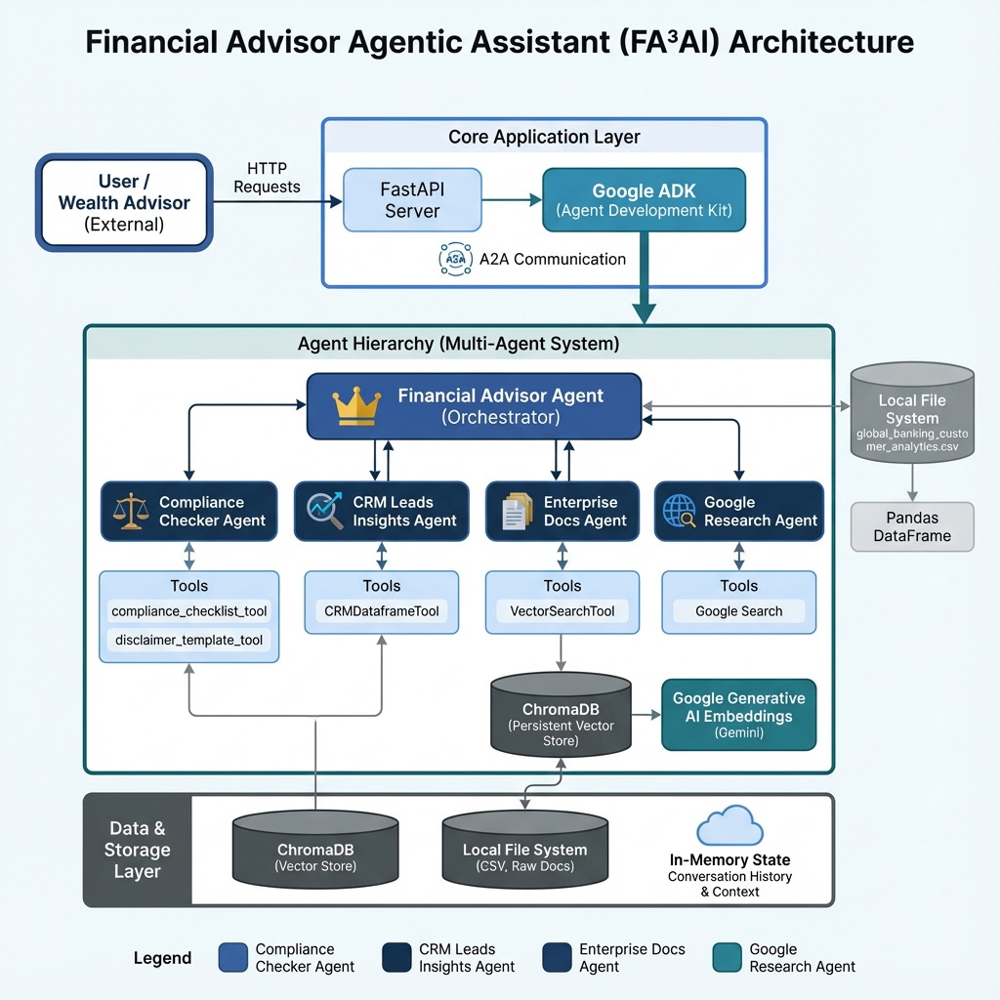
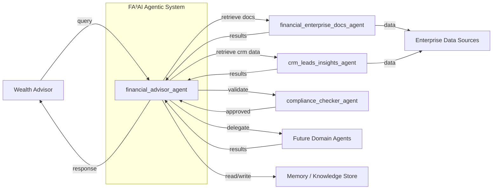

### Problem Statement

- Wealth advisors struggle with fragmented information, and they need to access multiple systems to correlate and synthesize data. Common systems used by wealth advisors include CRM platforms (e.g., Salesforce, Zoho), Portfolio management tools (e.g., Envestnet, Yodlee), Research platforms (e.g., Yahoo Finance, Morningstar), Financial data providers (e.g., Yodlee, MoneyGuidePro), and various market data sources (Pershing, Broadridge). However, these systems have different user interfaces and data retrieval approaches, which makes it slow, manual, and error-prone for advisors to find the right insight at the right moment.
- This slows down advisor productivity, increases compliance risk, and limits their ability to deliver timely, personalized advice to their clients.

### Solution Statement

The overall solution is built applying the multi-agent system architecture and *Google ADK* as the underlying framework & *Vertex AI Agent Engine* as Cloud Services with key highlights as:
- Agents can autonomously coordinate tasks like retrieving data, summarizing insights, and validating the results as per enterprise-specific guidelines
- Additionally, agents can elevate the conversation with advisors to understand the need better and act accordingly. Reasoning after retrieving data from multiple systems helps to synthesize the information, not just data retrieval.
- Agents can continuously learn from user interactions, remember previous interactions, and use feedback loops to enhance the system incrementally.
- In the future, Agents can also delegate actions to other AI Agents based on the insights discovered, such as updating the CRM system for the next client conversation, reviewing the financial plan, proactively using the interaction to update client communication history, etc.

### Architecture

FA³AI is an agentic knowledge assistant that unifies data and reasoning for wealth advisors.
The architecture leverages a multi-agent system (MAS) design using the ADK framework with agents as:
- `financial_advisor_agent`: Acts as the central intelligence layer, coordinating an ecosystem of specialized agents. It interprets user intent and routes requests to the right agents for knowledge retrieval across multiple systems. *Google’s Agent Development Kit (ADK)* enables the creation of this centralized orchestrator with built-in reliability, security, and enterprise-grade capabilities. [Workflow Agents](https://google.github.io/adk-docs/agents/workflow-agents/) orchestrator capability helps to manage the execution flow of sub-agents.
- `financial_enterprise_docs_agent`: Enterprise-specific knowledge retriever agent accessing proprietary, unstructured enterprise financial data sources such as PDFs and CMS-based knowledge hubs to enrich advisor responses with comprehensive document insights.
- `crm_leads_insights_agent`: CRM Leads and Prospects insights agent integrating CRM data (e.g., Salesforce, Zoho, Redtail, Hubspot) to provide structured, actionable customer relationship and pipeline intelligence in response to advisor queries.
- `compliance_checker_agent`:  Content validation agent ensuring advisor responses are complete, accurate, compliant with legal and regulatory standards, and that any personal or sensitive information is detected and redacted from outputs.

 

**Patterns Applied**:

- *LLM Orchestrator Pattern* for dynamic decision-making by Gemini as LLM
- *MCP Integration Pattern* for connecting to external, standardized services such as CRM Tools, Third-party Services
- *Session Management* using `Session Service` and `Persistent Session` for enterprises (surviving restarts, failovers)
- *Context Compaction* to automatically reduce the context that's stored in the Session (future advancement)
- *Agent Observability* with `LoggingPlugin` for production systems and `ADK Web UI` for development and testing
- *Agent Evaluation* with Google ADK (regression testing using adk eval, Tool trajectory and response metrics)
- *Agent Deployment* with `Vertex AI Agent Engine` and long-term memory with `Vertex AI Memory Bank`
- *Agent Communication* using A2A protocol as a standardized protocol for agent-to-agent communication  (to be implemented for future use as an enterprise expanding solution with external vendors)

### Extending Solution

If additional time is available, the above solution to be expanded using the construct below. 
As per the enterprise context, additional agents to be expanded to enrich FA³AI's agentic knowledge assistant, such as:
- `portfolio_management_agent`: Retrieving and reasoning with enterprise solutions such as *Envestnet, Yodlee* - each system can be accessed with a specialized associated tool
- `financial_research_agent`: Researching from the downstream third-party tools for *Morningstar, Yahoo Finance*, and consolidating the knowledge
- `crm_analyzer_agent`: Retrieves client's data from CRM systems such as *Salesforce, Zoho, Redtail,* etc. 
- `financial_planning_agent`: Fetches the client's financial plan (as needed) and use  this information to contextualize the information to answer the related questions

### Technical Implementation Details

| Component | Technology | Purpose |
| :--- | :--- | :--- |
| **Agent Framework** | **Google Agent Development Kit (ADK)** | The core framework for defining, developing, and coordinating the multi-agent system, including all agent logic and workflows. |
| **Agent Hosting** | **Vertex AI Agent Engine Runtime** | A fully managed, serverless environment for deploying, running, and scaling the entire ADK-based agent application. |
| **Long-Term Memory**| **Vertex AI Agent Engine Memory Bank** | Provides persistent, long-term memory, enabling agents to learn from and recall information across multiple conversations. |
| **Session Memory** | **Vertex AI Agent Engine Session Service** | Manages the short-term context and history of a single, ongoing conversation for immediate relevance. |
| **MCP Tools Hosting** | **Google Cloud Run** | A serverless platform for hosting the Model Context Protocol (MCP) servers, which act as secure and scalable tools for agents to interact with external data sources (e.g., CRMs, APIs). |

### Architecture View

### Value Statement

- **Increased Advisor Efficiency**:  Higher advisor efficiency by 25-30% (10-12 hours/week efforts saved with seamless access to data from a diverse set of systems)
- **Higher Engagement Rate**: 10-20% higher engagement rate with clients, with valuable insights enriching personalized engagement
- **Quicker Decision Making**: Ease of decision making around products, servicing, client portfolio, market insights, etc.  based on synthesized information

### FA³AI: Consolidated Agent Tools and Utilities (including Future Tools)

| Tool / Utility | Primary Agent(s) | Purpose |
| :--- | :--- | :--- |
| **VectorSearchTool** | `knowledge_retriever` | Searches internal documents (PDFs, CMS) using vector embeddings to find relevant information. |
| **GoogleSearchTool** | `knowledge_retriever` | Searches Google using the Google Search API to find relevant information. |
| **CrmApiTool** | `crm_analyzer_agent` | **Reads** client data, history, and notes from CRM systems like Salesforce or Redtail. |
| **PortfolioApiTool** | `portfolio_management_agent` | **Reads** client portfolio holdings, performance, and asset allocation from systems like Envestnet. |
| **FinancialMarketDataTool**| `financial_research_agent` | **Fetches** live and historical market data (stocks, funds) from third-party sources like Morningstar. |
| **ResponseValidationSuite**| `content_reviewer` | A suite of checkers used to validate the final response before it is shown to the advisor. |
| `└─ DisclaimerChecker` | `content_reviewer` | Sub-tool: Ensures mandatory legal disclaimers are included in the response. |
| `└─ ForbiddenPhraseChecker`| `content_reviewer` | Sub-tool: Scans for prohibited words or guarantees (e.g., "risk-free," "guaranteed"). |
| `└─ CompletenessChecker`| `content_reviewer` | Sub-tool: Verifies that the response fully addresses the advisor's original query. |
| **CrmUpdateTool** | `knowledge_orchestrator_agent` | **Writes** data back to the CRM, such as logging a summary of the client interaction. |
| **NotificationTool** | `knowledge_orchestrator_agent` | Sends proactive alerts or notifications to the advisor via email or chat. |
| **InteractionLogger** | `knowledge_orchestrator_agent` | Saves the final query, response, and feedback to the Memory Bank for continuous learning and auditing. |