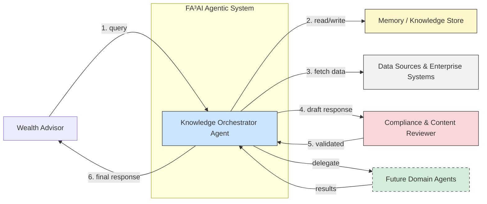

### Architecture View

```mermaid
graph LR
  %% Actors
  U[Wealth Advisor]

  %% Core
  subgraph Core["FA³AI Agentic System"]
    CA[Knowledge Orchestrator Agent]
  end

  %% Supporting components
  M[Memory / Knowledge Store]
  DS[Data Sources & Enterprise Systems]
  R[Compliance & Content Reviewer]
  FA[Future Domain Agents]

  %% Flow
  U -->|1. query| CA
  CA -->|2. read/write| M
  CA -->|3. fetch data| DS
  CA -->|4. draft response| R
  R -->|5. validated| CA
  CA -->|6. final response| U

  %% Delegation
  CA -->|delegate| FA
  FA -->|results| CA

  %% Styling (keeps it minimal)
  classDef core fill:#cce5ff,stroke:#333;
  classDef mem fill:#fff7cc,stroke:#333;
  classDef ds fill:#f1f1f1,stroke:#333;
  classDef rev fill:#f8d7da,stroke:#333;
  classDef future fill:#d4edda,stroke:#333,stroke-dasharray:5 5;

  class CA core;
  class M mem;
  class DS ds;
  class R rev;
  class FA future;
```
