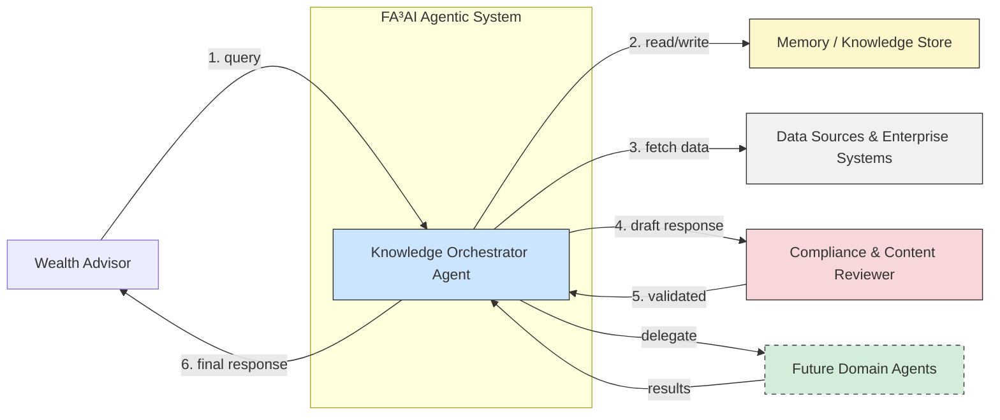

### Architecture View

Of course. Here is the consolidated list of essential agent tools and utilities, with the security-focused system guardrails removed, in a single Markdown table.

### FA³AI: Consolidated Agent Tools and Utilities (including Future Tools)

| Tool / Utility | Primary Agent(s) | Purpose |
| :--- | :--- | :--- |
| **VectorSearchTool** | `knowledge_retriever` | Searches internal documents (PDFs, CMS) using vector embeddings to find relevant information. |
| **CrmApiTool** | `crm_analyzer_agent` | **Reads** client data, history, and notes from CRM systems like Salesforce or Redtail. |
| **PortfolioApiTool** | `portfolio_management_agent` | **Reads** client portfolio holdings, performance, and asset allocation from systems like Envestnet. |
| **FinancialMarketDataTool**| `financial_research_agent` | **Fetches** live and historical market data (stocks, funds) from third-party sources like Morningstar. |
| **ResponseValidationSuite**| `content_reviewer` | A suite of checkers used to validate the final response before it is shown to the advisor. |
| `└─ DisclaimerChecker` | `content_reviewer` | Sub-tool: Ensures mandatory legal disclaimers are included in the response. |
| `└─ ForbiddenPhraseChecker`| `content_reviewer` | Sub-tool: Scans for prohibited words or guarantees (e.g., "risk-free," "guaranteed"). |
| `└─ CompletenessChecker`| `content_reviewer` | Sub-tool: Verifies that the response fully addresses the advisor's original query. |
| **CrmUpdateTool** | `knowledge_orchestrator_agent` | **Writes** data back to the CRM, such as logging a summary of the client interaction. |
| **NotificationTool** | `knowledge_orchestrator_agent` | Sends proactive alerts or notifications to the advisor via email or chat. |
| **InteractionLogger** | `knowledge_orchestrator_agent` | Saves the final query, response, and feedback to the Memory Bank for continuous learning and auditing. |

